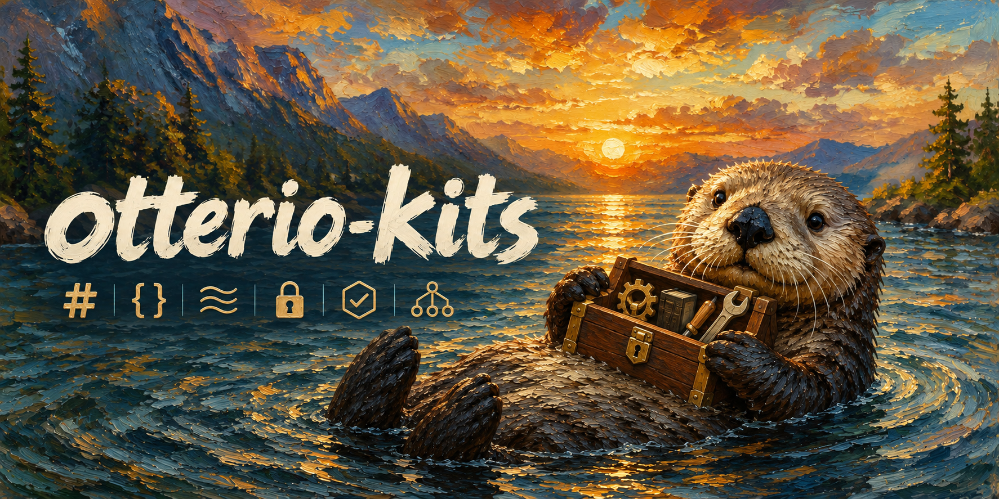

<div align="center">

[](https://github.com/soulteary/otterio-kits)

# otterio-kits

**Core Go Libraries** — _Hashing, JSON parsing, and streaming encryption._

[](./LICENSE)
[](./go.work)
[](https://github.com/soulteary/otterio-kits)

</div>

otterio-kits is a collection of six core Go libraries for hashing, checksums, SIMD JSON parsing, and streaming encryption, independently maintained by OtterIO. It brings together the libraries used by [OtterIO](https://github.com/soulteary/otterio) and [OC](https://github.com/soulteary/oc), with a separate `go.mod`, tests, license materials, and release versions for each library.

This README introduces the libraries and their development workflow. The [documentation index](./docs/README.md) links maintenance, CI, release, and provenance guides; the [OtterIO SDK](https://github.com/soulteary/otterio-sdk), a fork of `minio-go/v7`, is maintained in a separate repository.

> [!IMPORTANT]
> otterio-kits is an independent, community-maintained collection of upstream Go libraries. It is **not** affiliated with, endorsed by, or sponsored by MinIO, Inc. Original copyright notices and applicable license materials are retained; see [licenses and provenance](./docs/LICENSES.md) and [UPSTREAMS.json](./UPSTREAMS.json).

---

## What is otterio-kits

otterio-kits is a multi-module repository: each library can be imported and released independently, while the root Go workspace supports joint local development. Original package names and public APIs are retained; consumers must explicitly migrate their imports to `github.com/soulteary/otterio-kits/<directory>`.

The libraries were imported from fixed upstream versions with their original Git history. Release procedures and candidate versions are documented separately; version examples do not indicate published releases.

## Libraries

- [`highwayhash`](highwayhash/README.md): keyed HighwayHash, imported from `minio/highwayhash v1.0.4`.
- [`sha256-simd`](sha256-simd/README.md): CPU-accelerated SHA-256, imported from `minio/sha256-simd v1.0.1`.
- [`simdjson-go`](simdjson-go/README.md): SIMD JSON parsing, imported from `minio/simdjson-go v0.4.5`.
- [`sio`](sio/README.md): DARE streaming encryption, imported from `minio/sio v0.5.1`.
- [`crc64nvme`](crc64nvme/README.md): CRC-64/NVME, imported from `minio/crc64nvme v1.1.1`.
- [`md5-simd`](md5-simd/README.md): parallel MD5, initially imported from `minio/md5-simd v1.1.2` and updated through upstream commit `9079a805` (2025-04-02, unreleased master changes).

Module paths use `github.com/soulteary/otterio-kits/<directory>`. Original package names and public APIs are retained; consumers must explicitly migrate their imports. The initial import did not change otterIO or OC dependencies.

## Development and validation

The six runtime modules, two helper modules, and root workspace use **Go 1.27.2**, matching otterIO and OC. CI reads the version from `go.work` and runs each runtime module on Linux amd64, macOS ARM64, and Windows amd64. Repository checks enforce matching Go directives across all modules. The root `go.work` supports joint local development.

Run these commands from the repository root:

```sh
python3 scripts/verify-upstreams.py
bash scripts/check-modules.sh verify
bash scripts/check-modules.sh test
bash scripts/check-modules.sh noasm
bash scripts/check-modules.sh race
bash scripts/check-modules.sh cross
bash scripts/check-modules.sh tools
```

The check script runs modules independently with `GOWORK=off`, collects results for all selected modules, and returns an aggregate status. Add a module path after the mode to select one module. `cross` only compiles target packages and test binaries. `tools` runs the MD5 generator, compiles its temporary output, and smoke-tests retained JSON benchmarks. See [module tests and extended platforms](docs/CI_TESTS.md) for additional checks.

The `simdjson-go` parser requires AVX2/CLMUL on amd64. ARM64 and `noasm` builds provide unsupported-platform stubs. Host tests report CPU support; skipped parsing tests do not establish parser correctness.

## History, provenance, and releases

Each upstream was imported using a subtree merge without `--squash`, preserving the fixed version's original commit SHAs, authors, and ancestry. Imported subtrees were checked against the original upstream trees. Module-path changes and maintenance configuration were committed separately.

[UPSTREAMS.json](UPSTREAMS.json) records upstream and import SHAs. Filtering history by the current subdirectory may omit upstream commits; inspect them with `git log <upstream-sha>` or `git show <upstream-sha>:<original-path>`.

Independent release tags use `<directory>/vX.Y.Z`, such as `highwayhash/v1.0.5`. Provenance tags under `upstream/<directory>/<upstream-version>` are not Go module release tags.

English is the primary documentation language. Start with the [documentation index](docs/README.md) for maintenance, CI, release procedures, and historical validation records.

## Licenses

All six modules have Apache-2.0 as their primary license. Applicable Go Authors BSD and Igneous MIT materials are also retained. Each independent release includes its own `LICENSE*`, `NOTICE`, and original source attributions. See [licenses and provenance](docs/LICENSES.md) for the inventory and outstanding source-history checks.
